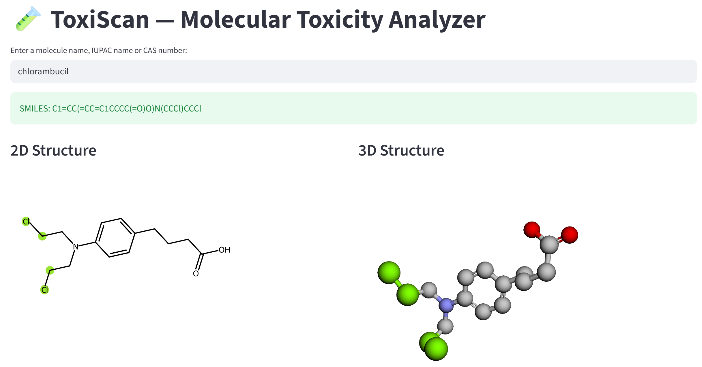
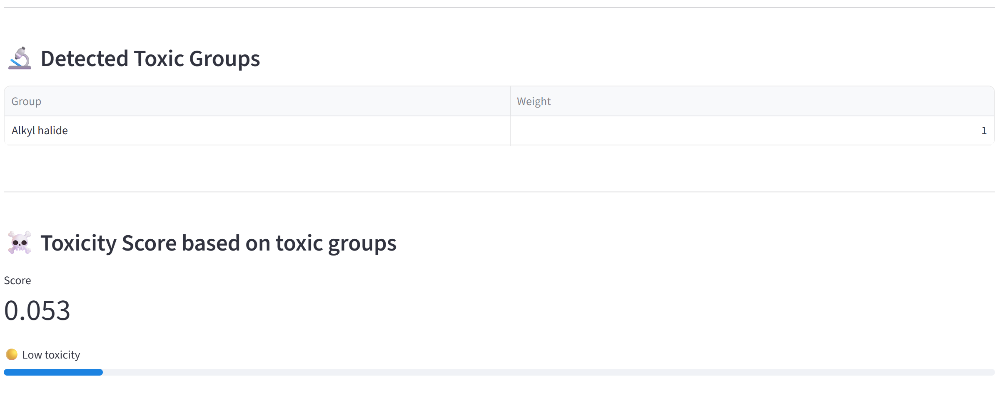
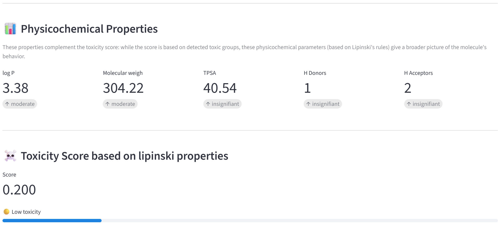

# ToxiScan 🧪
[logo/banner]
[badges]

## Package description 📖
**ToxiScan** is a Python package designed to evaluate the toxicity of molecules, aimed at chemists, students, and researchers who need fast and visual toxicity insights.

Given a molecule name as input, ToxiScan:
  1. Retrieves its SMILES representation from the **PubChem** database
  2. Detects toxic functional groups via **SMARTS pattern matching**
  3. Visualizes the molecule in **2D and 3D** with toxic fragments highlighted in green
  4. Computes a **toxicity score** based on detected toxicophores and physicochemical properties

## Authors 🧑‍🎓
This project was developed as part of the *Practical Programming in Chemistry* course at EPFL.

| Name | GitHub |
|------|--------|
| Laurane Suard | [@lauranesuard](https://github.com/lauranesuard) |
| Flore Leveillé-Nizerolle | [@floreln](https://github.com/floreln) |
| Nina Deruaz | [@ninaderuaz](https://github.com/ninaderuaz) |

## Features 🔬

- **Toxicophore detection**: scan of the molecule (SMILES string form) to identify the toxic substructures (epoxides, nitro groups, aldehydes...)
- **Toxicity scoring**: normalized score based on type and severity of detected toxicophores, combined with physicochemical properties (Lipinski's rules)
- **2D visualization**: molecule drawn in black and white with toxic atoms highlighted in green
- **3D interactive visualization**: rotate and zoom on the molecule with py3Dmol, toxic atoms highlighted in green
- **Streamlit app**: user-friendly interface to analyze any molecule in seconds

## Installation 💻
First, clone the repository and navigate into the project directory:

```bash
git clone https://github.com/lauranesuard/ToxiScan.git
cd ToxiScan
```

Then, create and activate the conda environment:

```bash
conda env create -f environment.yml
conda activate toxiscan-env
```

Finally, install the package in editable mode:

```bash
pip install -e .
```

## Requirements 📝
ToxiScan requires Python 3.11. The following packages are needed:

- `rdkit`
- `requests`
- `streamlit`
- `py3dmol`
- `ipython`
- `pytest`

If the installation completes successfully, all required packages should be installed automatically via the `environment.yml` file. To verify that everything is correctly set up, run:

```bash
conda list
```

If any package is missing, install them manually:

```bash
conda install -c conda-forge rdkit
conda install requests streamlit pytest ipython
pip install py3dmol
```

## Usage 🚀

## Interface 🌐
ToxiScan comes with a **Streamlit app** that provides an interactive interface to analyze any molecule visually.

To launch the app, run the following command from the project directory:

```bash
streamlit run app.py
```

The app allows you to:
- Enter any molecule name
- View the **2D structure** with toxic fragments highlighted in green
- Explore the **interactive 3D structure** with py3Dmol
- See the **toxicity scores** — based on detected toxicophores and physicochemical properties (Lipinski's rules)

Here is an example of ToxiScan's output for **chlorambucil** : 






## Run tests ✅
To run the test suite, execute the following command from the project directory:

```bash
python -m pytest tests/
```

You should see all tests passing:

```
25 passed 
```

## Troubleshooting 🔧
If you encounter any issue while using ToxiScan, here are the most common problems and their solutions.
**`ModuleNotFoundError: No module named 'toxiscan'`**
Make sure you have installed the package in editable mode:
```bash
pip install -e .
```

**Molecule not found in PubChem**
Check the spelling of the molecule name. ToxiScan only accepts names recognized by PubChem (e.g. "aspirin", "caffeine"). Try the common English name of the molecule.

**Environment issues**
If `conda env create -f environment.yml` fails, create the environment manually:
```bash
conda create -n toxiscan-env python=3.11
conda activate toxiscan-env
conda install -c conda-forge rdkit
conda install requests streamlit pytest ipython
pip install py3dmol
```

**Streamlit app not launching**
Make sure you are in the project root directory and that the environment is activated before running `streamlit run app.py`.

## License 📜

